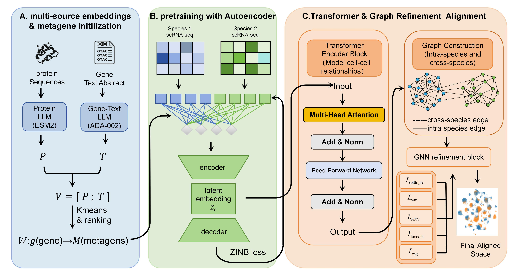

# MetaGeneFormer: Multi-Source Metagene Learning for Cross-Species Single-Cell Integration

MetaGeneFormer is a two-stage cross-species single-cell integration framework built on top of SATURN-style macrogene pretraining and a downstream Transformer + graph refinement module.

In our pipeline:

1. **Stage I: SATURN-style pretraining (`train-saturn.py`)**
   - Multiple scRNA-seq count matrices from different species are projected into a shared metagene space.
   - Unlike the original SATURN setup, the input gene representation is **multi-source**: we concatenate **protein embeddings** and **gene-text embeddings** before macrogene initialization and pretraining.
   - This stage produces a **pretraining AnnData** (`*_pretrain.h5ad`).

2. **Stage II: MetaGeneFormer refinement (`metageneformer.py`)**
   - The pretraining `.h5ad` from Stage I is used as input.
   - MetaGeneFormer performs label-informed / weakly supervised refinement with:
     - Transformer-based global cell-cell modeling
     - Intra-species graph smoothing
     - Cross-species MNN alignment
     - SoftTriple supervision, variance regularization, and graph refinement
   - The final embedding is stored in:
     - `adata.obsm["X_embed_transformer"]`

---

## Model Overview

<p align="center">
  
</p>

The framework contains three main components:

- **A. Multi-source embeddings & metagene initialization**  
  Protein embeddings (e.g. ESM2) and gene-text embeddings are concatenated and used to initialize metagenes.

- **B. Pretraining with autoencoder**  
  A SATURN-style pretraining stage learns metagene-based cell representations from multi-species scRNA-seq count data.

- **C. Transformer & graph refinement alignment**  
  MetaGeneFormer further refines the pretrained representation using a Transformer encoder, intra-/cross-species graph construction, and multiple alignment losses.

---

## Repository Structure

```text
.
├── train-saturn.py         # Stage I: SATURN-style pretraining
├── metageneformer.py       # Stage II: MetaGeneFormer refinement
├── README.md
├── KDD_model6.jpg          # MetaGeneFormer figure
└── ...
```

---

## Input Data

### Stage I: `train-saturn.py`
`train-saturn.py` expects a CSV file describing the input datasets. Based on the original SATURN format, the CSV should contain at least:

- `path`: path to the input `.h5ad` file
- `species`: species name
- `embedding_path`: path to the corresponding gene embedding `.torch` file (optional if handled elsewhere)

Each input `.h5ad` should contain:

- raw or count-like expression matrix in `adata.X`
- a cell-type label column (e.g. `labels2`)
- optionally a reference label column for coarse supervision

### Stage II: `metageneformer.py`
`metageneformer.py` takes the **pretraining AnnData** generated by Stage I as input.

The input `.h5ad` should contain:

- `obs["species"]`
- `obs["labels2"]` (or another label column specified by `--label_key`)

---

## Multi-Source Gene Embeddings

The main difference from the original SATURN pipeline is that we **replace the original protein-only gene representation** with a **concatenated multi-source embedding**:

```text
multi_source_gene_embedding = [protein_embedding ; gene_text_embedding]
```

This multi-source embedding is then used by `train-saturn.py` for metagene initialization and pretraining.

We also provide the **processed concatenated protein + gene-text embeddings** used in our experiments. These files have been uploaded to **Google Drive** for convenient access:

- **Google Drive link:** `https://drive.google.com/file/d/1xUT0PDyl8bRg7C_ThwrALSrmEme8NVXT/view?usp=sharing`

These embeddings can be used directly as the input gene representations for `train-saturn.py`, without requiring users to regenerate the protein and gene-text embeddings from scratch.

---

## Installation

Install the dependencies similarly to the original SATURN environment:

```bash
pip install -r requirements.txt
pip install torch==1.10.2+cu113 -f https://download.pytorch.org/whl/cu113/torch_stable.html
```

You will also need common packages such as:

- `scanpy`
- `anndata`
- `scikit-learn`
- `numpy`
- `pandas`
- `psutil`
- `torch`

---

## Running MetaGeneFormer

## Step 1. SATURN-style pretraining

Run `train-saturn.py` first to obtain the pretraining output.

Example:

```bash
python train-saturn.py \
  --in_data /path/to/input_data.csv \
  --in_label_col labels2 \
  --ref_label_col labels2 \
  --embedding_model ESM2 \
  --device cuda:0
```

Important notes:

- In our setup, the embeddings supplied to this stage are **not protein-only**; they are the **concatenated protein + gene-text embeddings**.
- This stage outputs a pretraining AnnData:

```text
{run_name}_pretrain.h5ad
```

From the SATURN code and README, the pretraining AnnData keeps:

- `obs["labels2"]`
- `obs["species"]`
- `obs["ref_labels"]`
- `obsm["macrogenes"]`

---

## Step 2. MetaGeneFormer refinement

Use the Stage I pretraining output as input to `metageneformer.py`.

Example:

```bash
python metageneformer.py \
  --input_h5ad /path/to/run_name_pretrain.h5ad \
  --outdir /path/to/output_dir \
  --label_key labels2 \
  --species_key species \
  --device cuda:0
```

You can also specify a label fraction for weak supervision:

```bash
python metageneformer.py \
  --input_h5ad /path/to/run_name_pretrain.h5ad \
  --outdir /path/to/output_dir \
  --label_key labels2 \
  --species_key species \
  --label-fraction 1.0 \
  --device cuda:0
```

Or sweep multiple fractions:

```bash
python metageneformer.py \
  --input_h5ad /path/to/run_name_pretrain.h5ad \
  --outdir /path/to/output_dir \
  --label_key labels2 \
  --species_key species \
  --sweep 0.1 0.3 0.5 0.7 0.9 1.0 \
  --device cuda:0
```

---

## Main Outputs

### Stage I: `train-saturn.py`
Main output used by MetaGeneFormer:

- `{run_name}_pretrain.h5ad`

### Stage II: `metageneformer.py`
For each label fraction, the script writes a refined `.h5ad` file under:

```text
{outdir}/fraction_{label_fraction}/
```

The saved AnnData contains:

- `obsm["X_embed_transformer"]`: final MetaGeneFormer embedding
- `obsm["X_umap"]`: UMAP coordinates
- `obs["leiden_transformer"]`: Leiden clusters

By default, the output filename is:

```text
metageneformer_fraction_{label_fraction}.h5ad
```

---

## Key Arguments

### `train-saturn.py`
Useful arguments from the provided script include:

- `--in_data`: CSV describing input datasets
- `--in_label_col`: cell-type label column
- `--ref_label_col`: reference/coarse label column
- `--embedding_model`: embedding model name used in loading embeddings
- `--hv_genes`: number of HVGs
- `--num_macrogenes`: number of metagenes/macrogenes
- `--pretrain_epochs`: number of pretraining epochs
- `--device`: device string such as `cuda:0`

### `metageneformer.py`
Useful arguments include:

- `--input_h5ad`: input pretraining `.h5ad`
- `--outdir`: output directory
- `--label_key`: cell-type label column, default `labels2`
- `--species_key`: species column, default `species`
- `--label-fraction`: fraction of labeled cells used for SoftTriple supervision
- `--sweep`: run multiple label fractions
- `--embedding-dim`: output embedding dimension, default `256`
- `--epochs`: training epochs
- `--batch-size`: mini-batch size
- `--device`: device string such as `cuda:0`
- `--output_embedding_key`: output embedding key, default `X_embed_transformer`
- `--leiden_key`: Leiden key, default `leiden_transformer`

---

## Recommended Workflow

```text
1. Prepare multi-species scRNA-seq count AnnData files
2. Prepare multi-source gene embeddings = [protein ; gene-text]
3. Run train-saturn.py to get *_pretrain.h5ad
4. Run metageneformer.py using *_pretrain.h5ad as input
5. Use adata.obsm["X_embed_transformer"] for downstream analysis
```

---

## Acknowledgement

This project is built on top of the original SATURN framework and adapts its pretraining stage for a multi-source embedding setting. The downstream MetaGeneFormer module extends this pipeline with Transformer-based and graph-based cross-species refinement.
